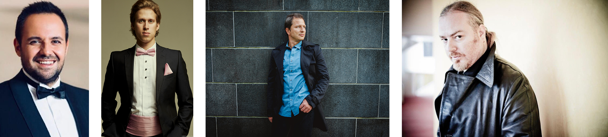
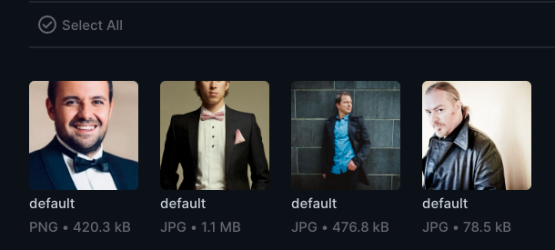
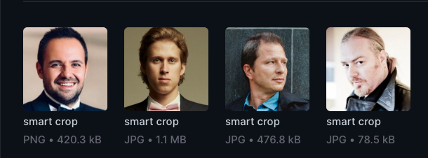
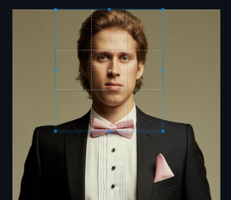

# Directus Assets extension

Smarter image resizing for [Directus][1].

This is a port of the "Important part of an image" feature from [Contao CMS][6].

## Installation

The extension is available as NPM package:

```bash
npm install @ameotoko/directus-extension-assets
```


## What does it do?

The extension allows you to mark an "important part" of any image in your
File Library. The selected area will always be preserved when image is
automatically [cropped][2] by Directus, i.e. when both new width and new height is set,
and the resulting aspect ratio differs from the original aspect ratio.

**Original images:**



**Default crop by Directus:**



**Smart crop by the extension:**




## Usage

To enable smart cropping for an image, go to image editing screen and mark the
important part of the image by mouse-dragging across the image preview:



To reset the selection, double-click inside the blue rectangle.

## Use cases

### Gallery

This allows you to easily implement such content as e.g. an image gallery
of portraits of avatars, where each source file can have different aspect
ratio, but must be displayed at the same size and aspect ratio in the frontend.

Just define your [image size preset][3] once in the Data Studio, and request it
in your frontend component, for example in React:

```jsx

```

Then, all you or your editors have to do is set the focal point whenever new
image is uploaded.

### HTML Responsive images

Another use-case might be implementing [responsive images][4] in your project.
You might want to define different image size presets for various breakpoints,
and then use them in `srcset` attribute. Here's a rewritten [example][5] from the
MDN article:

```html

```

## Previous version

This extension previously provided simpler functionality, where `focal_point` of
an image could be set by a dropdown with 8 predefined options: "Top", "Left" etc.

If you need to use this functionality in your project, install the previous version
of the extension:

```bash
npm install @ameotoko/directus-extension-assets@1.0.0
```

[1]: https://directus.io
[2]: https://docs.directus.io/reference/files.html#requesting-a-thumbnail
[3]: https://docs.directus.io/user-guide/settings/project-settings.html#files-storage
[4]: https://developer.mozilla.org/en-US/docs/Learn/HTML/Multimedia_and_embedding/Responsive_images
[5]: https://developer.mozilla.org/en-US/docs/Learn/HTML/Multimedia_and_embedding/Responsive_images#resolution_switching_different_sizes
[6]: https://contao.org
