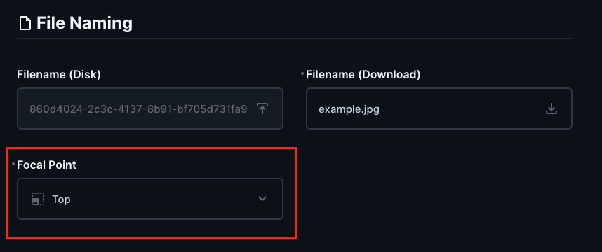
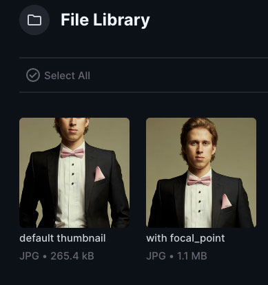

# Directus Assets extension

Smarter image resizing in [Directus][1].


## Installation

The extension is available as NPM package:

```bash
npm install @ameotoko/directus-extension-assets
```

Then copy or link the package folder to `extensions/` directory
of your Directus instance.


## What does it do?

When the extension is enabled in Directus, it adds a `Focal Point`
field in your File Library:



The field is added only for images (MIME-type `image/*`).

Using the `Focal Point` field, you can set an important part (a
"focal point") for each image in your file library individually.

If a focal point is set for an image, it will be preserved whenever
the image is [cropped][2].

Below is an example, how an image is processed with and without
the extension.

- original image:


- default thumbnail, and thumbnail with `focal_point` set to `Top`:




## Use cases

### Gallery

This allows you to easily implement such content as e.g. an image gallery
of portraits of avatars, where each source file can have different aspect
ratio, but must be displayed at the same size and aspect ratio in the frontend.

Just define your [image size preset][3] once in the Data Studio, and request it
in your frontend component, for example in React:

```jsx

```

Then, all you or your editors have to do is set the focal point whenever new
image is uploaded.

### HTML Responsive images

Another use-case might be implementing [responsive images][4] in your project.
You might want to define different image size presets for various breakpoints,
and then use them in `srcset` attribute. Here's a rewritten [example][5] from the
MDN article:

```html

```

[1]: https://directus.io
[2]: https://docs.directus.io/reference/files.html#requesting-a-thumbnail
[3]: https://docs.directus.io/user-guide/settings/project-settings.html#files-storage
[4]: https://developer.mozilla.org/en-US/docs/Learn/HTML/Multimedia_and_embedding/Responsive_images
[5]: https://developer.mozilla.org/en-US/docs/Learn/HTML/Multimedia_and_embedding/Responsive_images#resolution_switching_different_sizes
